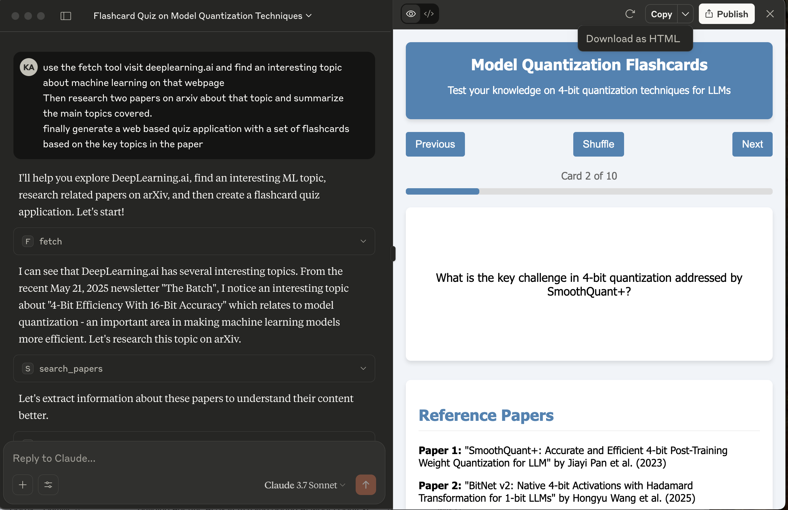

# Research Papers MCP server - credit - deeplearning.ai

MCP server uses arXiv, a free and open-access repository for scholarly articles, primarily in physics, mathematics, computer science, and related fields to find research papers based on the topic.  
It also provides following capabilities.
- search_papers - Search for papers on arXiv based on a topic
- extract_info - Get detailed information about a specific arXiv paper



## Prerequisites
* uv package manager
* Python

## Running locally
* Clone the project, navigate to the project directory and initiate it with uv:
```bash
    * uv init
```
* Create virtual environment and activate it:
```bash
    * uv venv
    * source .venv/bin/activate
```
* Install dependencies:
```bash
    * uv add mcp arxiv
```

## Configuration for Claude Desktop

You will need to supply a configuration for the server for your MCP Client. Here's what the configuration looks like for [claude_desktop_config.json](https://modelcontextprotocol.io/quickstart/user):

```
{
    "mcpServers": {
        
        "filesystem": {
            "command": "npx",
            "args": [
                "-y",
                "@modelcontextprotocol/server-filesystem",
                "."
            ]
        },
        
        "research": {
            "command": "uv",
            "args": ["run", "research_server.py"]
        },
        
        "fetch": {
            "command": "uvx",
            "args": ["mcp-server-fetch"]
        }
    }
}
```


